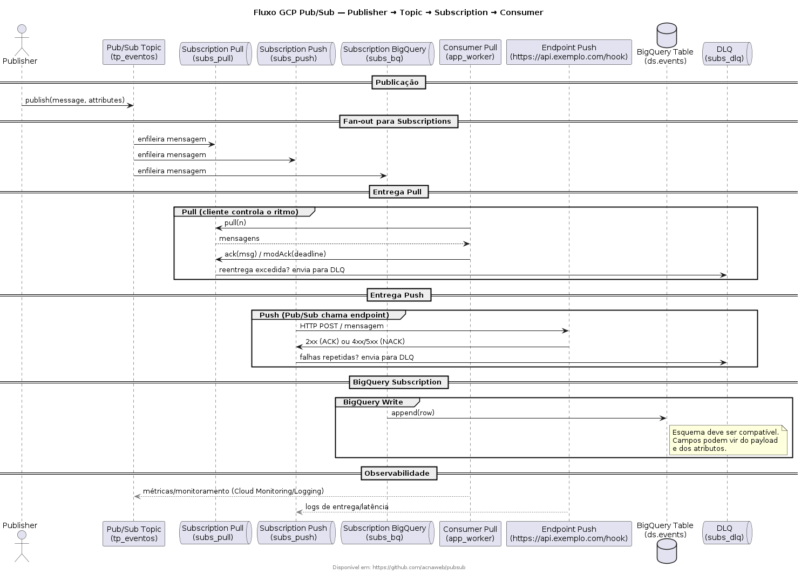
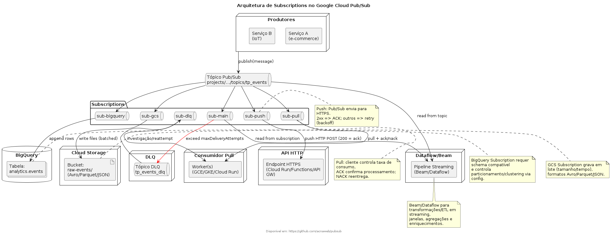

# **Google Cloud Pub/Sub**

## 1. Introdução  
O **Pub/Sub (Publisher/Subscriber)** do Google Cloud é um serviço de **mensageria assíncrona e escalável**, projetado para transmitir eventos em tempo real entre sistemas independentes. Ele permite que produtores (**publishers**) enviem mensagens para um **tópico**, e consumidores (**subscribers**) as recebam através de **subscriptions**.  

Essa arquitetura desacopla os componentes de um sistema, garantindo escalabilidade, tolerância a falhas e comunicação em tempo quase real.  

---

## 2. Conceitos Fundamentais  

- **Tópico (Topic)**: canal de comunicação para onde os publishers enviam mensagens.  
- **Mensagem (Message)**: unidade de dados publicada em um tópico (pode conter payload em JSON, Avro, Protobuf etc.).  
- **Assinatura (Subscription)**: define como as mensagens de um tópico serão entregues aos subscribers.  
- **Publisher**: sistema que envia a mensagem para um tópico.  
- **Subscriber**: sistema que recebe as mensagens de uma assinatura.  

---

## 3. Casos de Uso  

- **Integração entre microsserviços** → Comunicação desacoplada.  
- **Ingestão de dados em tempo real** → Logs, eventos de IoT, analytics.  
- **ETL/ELT em pipelines de dados** → Pub/Sub + Dataflow + BigQuery.  
- **Notificações e eventos em aplicações** → Exemplo: envio de alertas em apps.  

---

## 4. Boas Práticas  

- Usar **Dead Letter Queues (DLQ)** para mensagens que não puderem ser processadas.  
- Configurar **Ack Deadline** corretamente para evitar reentregas indesejadas.  
- Monitorar uso com **Cloud Monitoring** e **Logging**.  
- Usar **atributos de mensagens** para metadados (ex: tipo do evento, origem).  
- Avaliar **Pub/Sub Lite** para workloads previsíveis de alto volume e custo otimizado.  

# Tipos de Subscription no Pub/Sub GCP

## Definição de Subscription

- Uma **subscription** é uma configuração que conecta um **tópico (topic)** a um **consumidor**.  
- O Pub/Sub garante que as mensagens publicadas no tópico sejam entregues às assinaturas configuradas.  
- Cada assinatura mantém seu próprio cursor de leitura.  

No **Google Cloud Pub/Sub**, mensagens publicadas em um **tópico** só chegam aos **consumidores** se houver uma **subscription** configurada.  
O tipo de subscription define **como** as mensagens serão entregues e armazenadas, impactando **escalabilidade, latência e integração** com outros serviços (como BigQuery, Cloud Storage, Dataflow etc.).  

Sem a escolha correta do tipo, você pode ter problemas como:
- Mensagens duplicadas ou perdidas.  
- Alto custo de armazenamento desnecessário.  
- Atraso na entrega das mensagens.  
- Integração incorreta com destino (ex: BigQuery).  

## Solução

O Pub/Sub oferece dois tipos principais de **subscription** e algumas variações nativas:  

### 1. Pull Subscription (Padrão)
- O consumidor faz **pull** das mensagens via API Pub/Sub (gRPC/REST).  
- O cliente precisa **acknowledge** (ACK) a mensagem.  
- Escalável para consumidores distribuídos.  
- Flexível, mas exige implementação no cliente.  

### 2. Push Subscription
- O Pub/Sub **empurra** mensagens para um endpoint HTTPS configurado.  
- O subscriber deve responder com **200 OK** para confirmar recebimento.  
- Ideal para **Cloud Run, Cloud Functions ou APIs HTTP**.  
- Menos controle sobre a taxa de entrega.  

### 3. BigQuery Subscription
- Entrega mensagens diretamente em uma **tabela BigQuery**.  
- Útil para análise em near real-time sem pipeline intermediário.  
- Exige schema de mensagens compatível.  

### 4. Cloud Storage Subscription
- Armazena mensagens diretamente em arquivos no **Cloud Storage**.  
- Suporta formatos **Avro, Parquet, JSON**.  
- Latência maior (processamento em lote).  

### 5. Dead Letter Queue (DLQ)
- Associada a uma subscription principal.  
- Armazena mensagens que falharam após várias tentativas.  
- Evita perda de dados.  

### 6. Dataflow/Beam Consumer
- Não é uma subscription nativa, mas lê diretamente de tópicos ou subscriptions.  
- Ideal para **ETL em streaming** com transformações complexas.  

---

## Comparativo dos Tipos de Subscription

| Tipo de Subscription | Vantagens | Desvantagens | Casos de Uso |
|----------------------|-----------|--------------|--------------|
| **Pull** | - Maior controle sobre o ritmo de consumo - Funciona bem com múltiplos consumidores em paralelo - Evita sobrecarga de endpoints | - Exige implementação de cliente consumidor - Mais complexidade no código | Sistemas distribuídos que precisam processar mensagens de forma escalável (ex: microserviços, pipelines internos) |
| **Push** | - Entrega automática para um endpoint HTTPS - Menos código no cliente - Integra facilmente com Cloud Run, Cloud Functions | - Menor controle sobre taxa - Endpoint deve estar disponível - Retries podem gerar duplicidade | Notificações em tempo real para APIs, webhooks e microserviços simples |
| **BigQuery Subscription** | - Integração nativa com BigQuery - Ideal para analytics em near real-time - Evita pipeline adicional | - Estrutura rígida (schema compatível necessário) - Pode gerar custo alto em mensagens pequenas | Event logging, análise de eventos de IoT, auditoria de transações |
| **Cloud Storage Subscription** | - Armazenamento econômico e durável - Suporte a batch - Bom para arquivamento | - Latência maior (não é real-time) - Processamento em lote, não streaming | Arquivamento de logs, integração posterior com Spark/Dataflow, histórico de eventos |
| **Dead Letter Queue (DLQ)** | - Garante que mensagens com erro não sejam perdidas - Ajuda no debug e monitoramento - Pode ser ligada a qualquer subscription | - Exige monitoramento e tratamento separado - Aumenta a complexidade de governança | Mensagens que falham repetidamente em processamento, tolerância a falhas críticas |
| **Dataflow/Beam Consumer** | - Processamento real-time e escalável - Suporte a transformações complexas - Nativo no ecossistema GCP | - Custo mais elevado - Necessidade de pipelines Beam | ETL/ELT em streaming, agregações em tempo real, pipelines de ML |

---

## Alternativas de Arquitetura

* Somente Pull + Dataflow: usar um único sub-main consumido por Dataflow e distribuir para múltiplos sinks (BQ, GCS, APIs).
* Eventarc (para Push): substituir Push direto por Eventarc para roteamento inteligente com filtros.
* Fan-out com múltiplos tópicos: usar Dataflow para republicar mensagens em tópicos específicos (ex: tp_events_bq, tp_events_gcs).
* Schema Registry/Avro/Protobuf: padronizar mensagens para facilitar ingestão no BigQuery/Storage.

## Referencias

- https://cloud.google.com/pubsub/docs/overview?hl=pt-br
